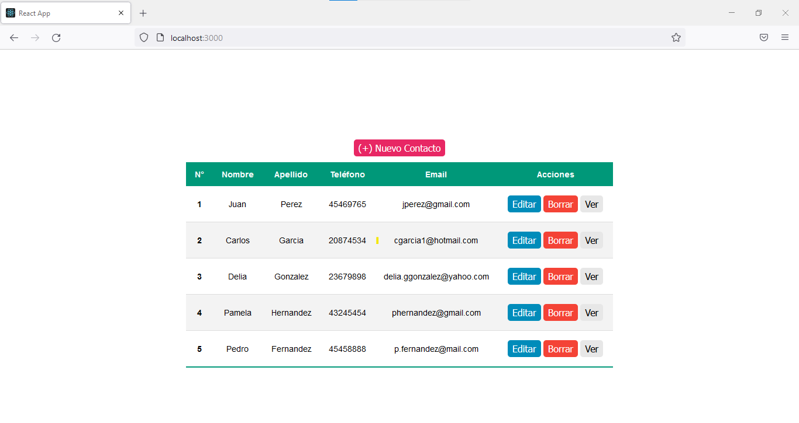
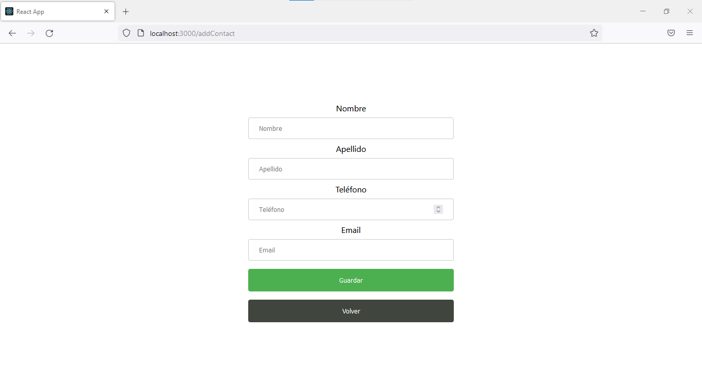
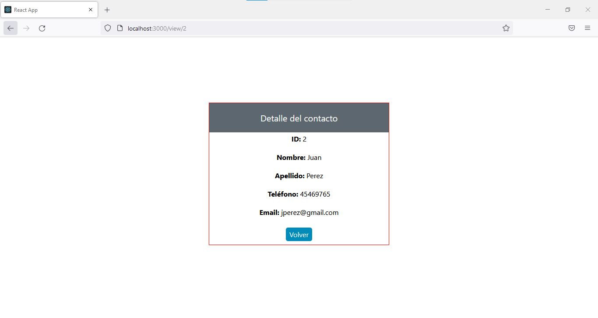

## Agenda Virtual

## Descripción:
        Se trata de una agenda personal para guardar contactos con su repectivo nombre, apellido, teléfono y mail.

## Funcionalidades:
* Ingresando en el Home se pueden visualizar los contactos agendados.
* Cuenta con un panel de "acciones", el mismo dispone de 3 botones: 
        "Editar" para editar al contacto.
        "Borrar" para borrarlo.
        "Ver" para verlo en detalle.
* El Home también cuenta con un botón "(+) Nuevo Contacto" para agregar nuevos contactos.

## Tecnologías:
* NODE JS (BACKEND)
* REACT JS (FRONTEND)

